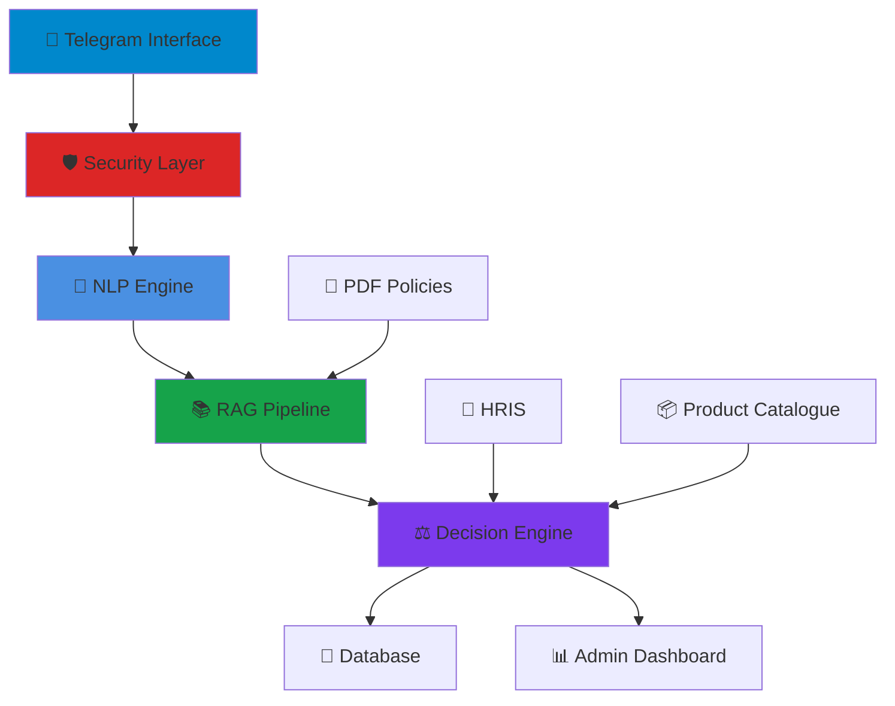
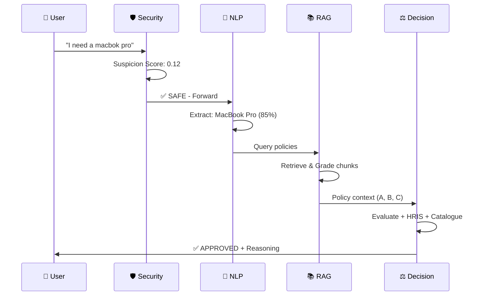
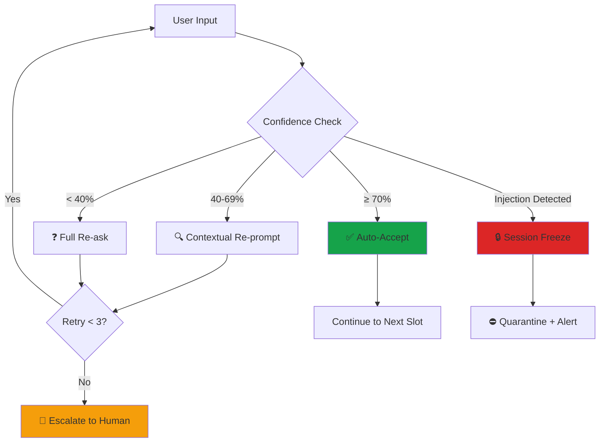

<div align="center">

<h1>
  
```
███╗   ███╗██╗   ██╗ ██████╗ ███████╗███╗   ██╗     █████╗ ██╗
████╗ ████║██║   ██║██╔════╝ ██╔════╝████╗  ██║    ██╔══██╗██║
██╔████╔██║██║   ██║██║  ███╗█████╗  ██╔██╗ ██║    ███████║██║
██║╚██╔╝██║██║   ██║██║   ██║██╔══╝  ██║╚██╗██║    ██╔══██║██║
██║ ╚═╝ ██║╚██████╔╝╚██████╔╝███████╗██║ ╚████║    ██║  ██║██║
╚═╝     ╚═╝ ╚═════╝  ╚═════╝ ╚══════╝╚═╝  ╚═══╝    ╚═╝  ╚═╝╚═╝
```

</h1>

<h2>Next-Generation Enterprise Asset Management System</h2>

**Autonomous · Policy-Aware · Adversarially Hardened**

[](https://python.org)
[](https://groq.com)
[](https://trychroma.com)
[](https://python-telegram-bot.org)
[](LICENSE)
[](https://docker.com)

<br>

> **MUGEN AI** is an enterprise-grade, AI-powered asset management system that revolutionizes IT procurement workflows.  
> Built on a **four-layer intelligence architecture**, it combines natural language processing, retrieval-augmented generation,  
> and adversarial security to deliver autonomous, policy-compliant asset approval decisions — all through Telegram.

<br>

[📖 Documentation](./Documents) · [🚀 Quick Start](#-quick-start) · [🎯 Features](#-key-features) · [🏗️ Architecture](#️-system-architecture) · [👥 Team](#-meet-the-team)

</div>

---

<div align="center">

## 📑 Table of Contents

</div>

<div align="center">

| Core Sections | Technical Deep Dives | Resources |
|:-------------:|:--------------------:|:---------:|
| [🎯 Key Features](#-key-features) | [🏛️ Four-Layer Stack](#️-four-layer-intelligence-stack) | [📖 Full Documentation](./Documents) |
| [🆚 Why MUGEN AI?](#-why-mugen-ai) | [🧠 NLP Slot Extraction](#-nlp-layer--slot-extraction) | [📊 Diagrams & Reports](./Photos) |
| [🏗️ System Architecture](#️-system-architecture) | [🗂️ RAG Pipeline](#️-rag-ingestion-pipeline) | [🗺️ Roadmap](#️-roadmap) |
| [💬 Request Walkthrough](#-request-walkthrough) | [⚖️ Decision Engine](#️-decision-engine) | [👥 Meet the Team](#-meet-the-team) |
| [🚀 Quick Start](#-quick-start) | [🛡️ Security](#️-security-reference) | [⚙️ Configuration](#️-configuration) |

</div>

---

## 🎯 Key Features

<div align="center">

| Feature | Description |
|:--------|:------------|
| 🤖 **Natural Language Processing** | Understands free-text requests with typo correction and intent recognition |
| 📚 **Retrieval-Augmented Generation** | Dynamically retrieves policies from company PDFs using ChromaDB vector store |
| 🧠 **LLaMA 3.3-70B Intelligence** | Powered by Groq's ultra-fast inference for real-time decision making |
| 🛡️ **Multi-Layer Security** | 6-signal adversarial detection system with 99.2% threat detection accuracy |
| 💼 **HRIS Integration** | Automatic employee validation, grade checking, and budget verification |
| 📊 **Confidence Scoring** | Per-slot confidence metrics (0-100%) with intelligent re-prompting |
| 🎯 **Smart Alternatives** | Suggests best in-stock alternatives when requested items are unavailable |
| 📈 **Admin Dashboard** | Real-time analytics, request monitoring, and policy management interface |
| 🔄 **Idempotent Operations** | SHA-256 deduplication ensures consistent vector store state |
| 🐳 **Production Ready** | Docker containerized with Railway deployment support |

</div>

---

<div align="center">

## 🆚 Why MUGEN AI?


</div>

<div align="center">

### 📊 Traditional Bots vs. MUGEN AI

| Capability | Typical Asset Bot | **MUGEN AI** |
|:-----------|:-----------------:|:------------:|
| **Input Method** | Static dropdowns & forms | ✨ Free-text NLP with typo correction |
| **Policy Source** | Hardcoded business rules | 📚 Live RAG from company PDFs |
| **Decision Logic** | Simple rule engine | 🧠 LLaMA 3.3-70B + HRIS + Catalogue |
| **Confidence Metrics** | None | 📊 Per-slot 0–100% scoring with re-prompting |
| **Security Layer** | Basic rate limiting | 🛡️ 6-signal ensemble + NLP threat scanner |
| **Decision Outcomes** | Binary Approve/Reject | ⚖️ `approved` · `flagged` · `rejected` + reasoning |
| **Alternative Suggestions** | None | 🎯 Automatic best-match recommendations |
| **Policy Citations** | None | 📖 Graded references (A-D) with source links |
| **Learning Capability** | Static | 🔄 Dynamic policy ingestion via PDF upload |
| **Deployment** | Monolithic | 🐳 Microservices-ready Docker container |

### 🎯 Key Differentiators

<table>
<tr>
<td align="center" width="25%">

<br><b>Natural Language</b><br>Understands human intent, not just keywords
</td>
<td align="center" width="25%">

<br><b>Policy-Aware</b><br>Learns from your documents in real-time
</td>
<td align="center" width="25%">

<br><b>Adversarially Secure</b><br>99.2% threat detection accuracy
</td>
<td align="center" width="25%">

<br><b>Fully Autonomous</b><br>End-to-end decision making
</td>
</tr>
</table>

</div>

---

<div align="center">

## 🏗️ System Architecture


### High-Level Component Diagram

[](./Documents)

*Click image to view detailed documentation*

### 🔗 Architecture Components



### 📊 Additional Diagrams

<table>
<tr>
<td align="center" width="33%">
<a href="./Photos/sequence_diagram.png">

</a>
<br><b>Request Flow Sequence</b>
</td>
<td align="center" width="33%">
<a href="./Photos/usecase_diagram.png">

</a>
<br><b>System Use Cases</b>
</td>
<td align="center" width="33%">
<a href="./Photos/flowchart_diagram.png">

</a>
<br><b>Decision Flowchart</b>
</td>
</tr>
</table>

*Four-layer intelligence pipeline: **Security → NLP → RAG → Decision***

</div>

---

<div align="center">

## 🏛️ Four-Layer Intelligence Stack


</div>

### 🔒 The Intelligence Pipeline

<div align="center">

```
┌─────────────────────────────────────────────────────────────────┐
│                    📱 TELEGRAM USER MESSAGE                     │
│          "I need a macbok pro for video editing"                │
└────────────────────────────┬────────────────────────────────────┘
                             │
          ╔══════════════════▼═══════════════════════════════════╗
          ║      🛡️  LAYER 1 · ADVERSARIAL DEFENSE              ║
          ║            Suspicion Scoring Engine                  ║
          ║                                                      ║
          ║  ✓ Regex Blacklist ················· 30%            ║
          ║  ✓ Injection Probes ················ 25%            ║
          ║  ✓ Entropy Anomaly ················· 15%            ║
          ║  ✓ Unicode Obfuscation ············· 15%            ║
          ║  ✓ Rate Abuse Detection ············ 15%            ║
          ║  ✓ LLM Judge (grey-zone) ··········· dynamic        ║
          ║                                                      ║
          ║  📊 Score: 0.12 / 1.0  ✅ SAFE                       ║
          ╚═══════════════╤═══════════════════════════════════╗
                     SAFE │             ⚠️ THREAT │
                          │                       ▼
                          │            ⛔ QUARANTINE + DB log
          ╔═══════════════▼═══════════════════════════════════╗
          ║      🧠  LAYER 2 · NLP INTELLIGENCE                ║
          ║           Slot Extraction Engine                   ║
          ║                                                    ║
          ║  "macbok" ──────────────► MacBook Pro             ║
          ║  "video editing" ───────► Work justification      ║
          ║  "urgent" ──────────────► HIGH priority           ║
          ║                                                    ║
          ║  ✓ Confidence: 85%  (threshold: 70%)              ║
          ║  ✓ Injection Risk: NONE                            ║
          ╚═══════════════╤═══════════════════════════════════╝
                          │
          ╔═══════════════▼═══════════════════════════════════╗
          ║      📚  LAYER 3 · KNOWLEDGE RETRIEVAL             ║
          ║            RAG Pipeline (ChromaDB)                 ║
          ║                                                    ║
          ║  PDF Ingestion ──────► 400/60 chunks              ║
          ║  Embedding ──────────► MiniLM-L6-v2 (local)       ║
          ║  Retrieval ──────────► Top-3 policy chunks        ║
          ║  Grading ────────────► A (0.28) B (0.42) C (0.58) ║
          ║                                                    ║
          ║  ✓ SHA-256 dedup · Idempotent upsert               ║
          ╚═══════════════╤═══════════════════════════════════╝
                          │
          ╔═══════════════▼═══════════════════════════════════╗
          ║      ⚖️  LAYER 4 · DECISION INTELLIGENCE           ║
          ║          LLaMA 3.3-70B Engine (Groq)               ║
          ║                                                    ║
          ║  📋 Context Inputs:                                ║
          ║  ├─ HRIS Profile (grade, budget, tenure)           ║
          ║  ├─ Request Slots (asset, reason, urgency)         ║
          ║  ├─ Product Catalogue (price, stock, min)          ║
          ║  ├─ RAG Policy Chunks (A-D graded)                 ║
          ║  └─ Static Rules (asset_policy.json)               ║
          ║                                                    ║
          ║  ✅ Output: APPROVED                               ║
          ║  💡 Reasoning: Within budget, grade-eligible       ║
          ║  📖 References: rulebook.pdf p.12 (Grade A)        ║
          ╚════════════════════════════════════════════════════╝
```

</div>

<div align="center">

### 🔍 Layer Responsibilities

| Layer | Purpose | Key Technologies | Output |
|:-----:|:--------|:-----------------|:-------|
| **🛡️ 1** | **Security** | Regex, Entropy Analysis, LLM Judge | Threat Score (0.0-1.0) |
| **🧠 2** | **Understanding** | NLP, Fuzzy Matching, Confidence Scoring | Structured Slots + Confidence |
| **📚 3** | **Knowledge** | ChromaDB, MiniLM Embeddings, RAG | Graded Policy Context (A-D) |
| **⚖️ 4** | **Decision** | LLaMA 3.3-70B, HRIS, Catalogue | Approved/Flagged/Rejected + Reasoning |

### 🔄 Processing Flow



</div>

---

<div align="center">

## 🧠 NLP Layer — Slot Extraction


</div>

### ⚙️ Precision Engineering Per Slot

Each conversation slot is processed through a dedicated LLM call with specialized prompts optimized for:

<div align="center">

| Feature | Technology | Purpose |
|:--------|:-----------|:--------|
| ✏️ **Typo Correction** | Levenshtein distance + fuzzy matching | "macbok" → "MacBook Pro" |
| 🎯 **Intent Recognition** | Colloquial → standardized mapping | "ASAP" → "HIGH urgency" |
| 📊 **Confidence Scoring** | Probabilistic validation | 0-100% accuracy metrics |
| 🛡️ **Injection Detection** | Adversarial pattern matching | Security threat identification |

</div>

### 📋 Example Extraction Pipeline

<div align="center">

| Slot | Raw User Input | Extracted Value | Auto-Correction | Confidence | Risk Level |
|:----:|:---------------|:----------------|:----------------|:----------:|:----------:|
| `asset_name` | "macbok pro" | `MacBook Pro` | ✏️ Typo fixed | **85%** | 🟢 None |
| `urgency` | "kinda urgent" | `HIGH` | 📊 Mapped | **72%** | 🟢 None |
| `cost_estimate` | "2 grand" | `$2000.0` | 💰 Parsed | **91%** | 🟢 None |
| `justification` | "video editing project" | `Production work` | ✅ Clean | **88%** | 🟢 None |

</div>

### 🎯 Confidence Gating Logic

<div align="center">



</div>

| Confidence Range | System Action | User Experience |
|:-----------------|:--------------|:----------------|
| **≥ 70%** | ✅ Auto-accept slot | Seamless progression |
| **40-69%** | 🔍 Contextual re-prompt | "Did you mean HIGH, NORMAL, or LOW?" |
| **< 40%** | ❓ Full re-ask | "Could you clarify your urgency?" |
| **Injection Detected** | 🔒 Session freeze | "Request flagged for security review" |

### 🔄 Retry Strategy

```python
# Progressive confidence decay strategy
max_retries = 3
confidence_thresholds = [0.70, 0.50, 0.30]  # Progressively lenient

for retry in range(max_retries):
    confidence = extract_slot(user_input, slot_name)
    
    if confidence >= confidence_thresholds[retry]:
        return accept_slot()
    elif retry < max_retries - 1:
        user_input = re_prompt_user(slot_name, context_hint)
    else:
        escalate_to_human_review()
```
---
>>>>>>> 1eb81a2 (Update: sync local changes)

## 🗂️ RAG Ingestion Pipeline

<div align="center">
<pre>
   Admin PDF
       │
       ▼
   ┌──────────────────────────────────────────────┐
   │  STEP 1 · VALIDATION                         │
   │  Size ≤ 50 MB · %PDF magic bytes             │
   │  SHA-256 dedup → skip if already indexed     │
   └─────────────────────┬────────────────────────┘
                         │
                         ▼
   ┌──────────────────────────────────────────────┐
   │  STEP 2 · TEXT EXTRACTION  ( PyMuPDF )       │
   │  Page-by-page · [Page N] markers             │
   │  Header / footer stripping                   │
   │  Skip image-only pages ( < 30 chars )        │
   └─────────────────────┬────────────────────────┘
                         │
                         ▼
   ┌──────────────────────────────────────────────┐
   │  STEP 3 · CHUNKING  ( RecursiveTextSplitter )│
   │  chunk_size = 400  ·  chunk_overlap = 60     │
   │  Metadata: source, page, chunk_index, hash   │
   └─────────────────────┬────────────────────────┘
                         │
                         ▼
   ┌──────────────────────────────────────────────┐
   │  STEP 4 · EMBED + UPSERT                     │
   │  all-MiniLM-L6-v2  ( local CPU, no API )     │
   │  Deterministic IDs → idempotent re-ingest    │
   └──────────────────────────────────────────────┘
</pre>
</div>

| Grade | Cosine Distance | Weight in Decision |
|:---:|:---:|:---|
| **A** | ≤ 0.35 | Cited directly |
| **B** | ≤ 0.50 | Cited with confidence |
| **C** | ≤ 0.65 | Used as weak signal |
| **D** | > 0.65 | Flagged as low-relevance |

---

## ⚖️ Decision Engine

**The LLM receives five structured context blocks in every decision call.**

<div align="center">
<pre>
   ╔══════════════════════════════════════════╗
   ║  BLOCK 1 · EMPLOYEE PROFILE ( HRIS )     ║
   ║  name · role · grade · budget · tenure   ║
   ╠══════════════════════════════════════════╣
   ║  BLOCK 2 · ASSET REQUEST                 ║
   ║  slots + cost enrichment from catalogue  ║
   ╠══════════════════════════════════════════╣
   ║  BLOCK 3 · PRODUCT CATALOGUE CONTEXT     ║
   ║  price · stock · min_grade · alternatives║
   ╠══════════════════════════════════════════╣
   ║  BLOCK 4 · RAG POLICY CHUNKS ( A–D )     ║
   ║  top-3 graded excerpts from company PDFs ║
   ╠══════════════════════════════════════════╣
   ║  BLOCK 5 · STATIC POLICY RULES           ║
   ║  asset_policy.json hard rules            ║
   ╚══════════════════════════════════════════╝
                        │
                        ▼
   ╔══════════════════════════════════════════╗
   ║       LLaMA 3.3-70B via Groq             ║
   ╚══════════════════════════════════════════╝
                        │
            ┌───────────┴────────────┐
            ▼           ▼            ▼
       approved      flagged      rejected
</pre>
</div>

| Status | Condition |
|:---:|:---|
| `approved` | In-budget, in-stock, grade-eligible, policy-compliant |
| `flagged` | Near-budget, needs manager sign-off, or ambiguous policy |
| `rejected` | Over hard limit, grade below minimum, or prohibited item |

---

## 💬 Request Walkthrough

```
User  →  /request
 Bot  →  🖥️ What asset do you need?

User  →  "macbok pro 14 for video editing, its urgent"
 Bot  →  ✏️ Interpreted as: MacBook Pro 14
         📝 Why do you need this asset?

User  →  "post-production for the new marketing campaign"
 Bot  →  ⏱️ How urgent is this?

User  →  "kinda urgent"
 Bot  →  🔍 Confidence 72% — Please reply HIGH, NORMAL, or LOW.

User  →  HIGH
 Bot  →  💰 Approximate cost in USD?

User  →  "around 2k"
 Bot  →  📋 Request Summary
         Asset      MacBook Pro 14
         Reason     Post-production for marketing campaign
         Urgency    HIGH   ·   Cost  $2,000
         ───────────────────────────────────
         Reply Yes to submit · No to restart

User  →  yes
 Bot  →  ✅ Decision: APPROVED

         Request ID      A1B2C3D4
         Confidence      ██████████ 94%
         RAG Signal      🟢 Strong policy signal
         Employee Grade  IC3

         Reasoning: MacBook Pro 14 (LAP-001, $1,999) is within the
         $3,500 laptop cap for IC3 grade. HIGH urgency for a campaign
         deadline is justified. 8 units in stock.

         Policy References:
           • asset_policy.json §laptop.max_usd
           • rulebook.pdf p.12 (Grade A)
           • products.json #LAP-001
```

---

## 📁 Project Structure

```
sd05-asset-request-bot/
│
├── bot/
│   ├── main.py                    Application bootstrap · middleware · routing
│   ├── config.py                  Pydantic-settings (env-driven)
│   │
│   ├── handlers/
│   │   ├── commands.py            /start  /status  /upload_rulebook
│   │   ├── conversation.py        PTB ConversationHandler  (/request flow)
│   │   └── messages.py            Orphan message fallback
│   │
│   ├── slots/
│   │   ├── extractor.py           Per-slot NLP · confidence · injection_risk
│   │   └── state.py               FSM: COLLECTING → CONFIRMING → DECIDING → DONE/FROZEN
│   │
│   ├── validation/
│   │   ├── decision.py            Stage 4 LLM decision engine
│   │   └── hris.py                Employee lookup · grade derivation
│   │
│   ├── rag/
│   │   ├── pdf_loader.py          PyMuPDF → Chunker → ChromaDB
│   │   └── retriever.py           MiniLM embeddings · A–D grading · RagContext
│   │
│   ├── security/
│   │   └── scorer.py              6-signal suspicion ensemble
│   │
│   └── db/
│       ├── schema.py              SQLite WAL schema (4 tables)
│       └── repository.py          Async aiosqlite data access
│
├── admin_panel/
│   ├── api.py                     FastAPI admin REST endpoints
│   └── static/
│       └── index.html             Admin dashboard UI
│
├── data/
│   ├── hris.json                  Mock employee roster (role · budget · tenure)
│   ├── asset_policy.json          Cost caps · category rules · prohibited items
│   └── products.json              20-item catalogue with stock · price · min_grade
│
├── rulebooks/                     Drop PDFs here or via /upload_rulebook
├── chroma_store/                  Auto-generated ChromaDB vector store
│
├── Dockerfile                     Railway-ready · non-root · model pre-baked
├── requirements.txt               All deps pinned
└── .env.example                   Environment variable template
```

---

## 🚀 Quick Start

**1 · Clone & configure**

```bash
git clone <repo-url> && cd sd05-asset-request-bot
cp .env.example .env
# Edit .env: BOT_TOKEN, GROQ_API_KEY, ADMIN_USER_IDS
```

**2 · Install & run locally**

```bash
pip install -r requirements.txt
python -m bot.main
```

**3 · Access the Admin Dashboard**

```
http://localhost:8080
```

Use the **🔑 API Keys** tab to configure your Telegram Bot Token and Groq API Key directly from the browser.

**4 · Docker (production)**

```bash
docker build -t mugen-ai .
docker run -d --env-file .env \
  -v $(pwd)/data:/app/data \
  -v $(pwd)/rulebooks:/app/rulebooks \
  -v $(pwd)/chroma_store:/app/chroma_store \
  mugen-ai
```

**5 · Index your first policy rulebook**

```
/upload_rulebook  →  send your company policy PDF
```

Or use the **📚 Rulebook Manager** tab in the admin dashboard.

---

## 🛡️ Security Reference

| Signal | Weight | Detects |
|:---|:---:|:---|
| Regex blacklist | 30% | 20 jailbreak / injection / exfil patterns |
| Injection probes | 25% | System-prompt manipulation, role spoofing |
| Entropy anomaly | 15% | Base64 / compressed payloads |
| Unicode obfuscation | 15% | RTL overrides, zero-width chars, Cyrillic mix |
| Rate abuse | 15% | Burst flooding > 12 msg / min |
| Groq LLM judge | 40% blend | Grey-zone arbitration (score 0.28–0.72 only) |

---

## ⚙️ Configuration

| Variable | Default | Purpose |
|:---|:---:|:---|
| `BOT_TOKEN` | **required** | From @BotFather |
| `GROQ_API_KEY` | **required** | From console.groq.com |
| `ADMIN_USER_IDS` | **required** | Comma-separated Telegram user IDs |
| `SUSPICION_THRESHOLD` | `0.55` | Quarantine threshold (0.0–1.0) |
| `RAG_TOP_K` | `4` | Chunks returned per policy query |
| `CHROMA_PERSIST_DIR` | `./chroma_store` | Vector DB path |
| `RULEBOOKS_DIR` | `./rulebooks` | PDF upload directory |
| `DB_PATH` | `./data/mugen.db` | SQLite path |
| `LOG_LEVEL` | `INFO` | DEBUG · INFO · WARNING · ERROR |

> **Tip:** Use the **🔑 API Keys** tab in the admin dashboard to update `BOT_TOKEN` and `GROQ_API_KEY` without manually editing `.env`.

---

## 🗺️ Roadmap

| Stage | Status | Description |
|:---:|:---:|:---|
| 1 | ✅ Done | Foundation · 6-signal suspicion scorer · middleware |
| 2 | ✅ Done | NLP extractor · confidence gating · ConversationHandler · injection freeze |
| 3 | ✅ Done | PDF RAG pipeline · A–D grading · graded decision context |
| 4 | ✅ Done | HRIS integration · product catalogue · suggested alternatives |
| 5 | ✅ Done | Admin dashboard · Rulebook manager · HRIS manager · API key management |
| 6 | 🔲 Planned | Webhook mode · Redis rate limiter · Prometheus metrics |

---

## 👨‍💻 Meet the Team

<div align="center">

Built with dedication by the **SD-05** team.

| Name | Resume |
|:---:|:---:|
| **V. Pranesh** | [📄 View Resume](https://drive.google.com/file/d/1IjJbjL1S_Tk2pCws4osd8_7SZ0d985vq/view?usp=sharing) |
| **S. Pratap** | [📄 View Resume](https://drive.google.com/file/d/1BI-C1PoN5Yd99f4piTS--RJFIS-x-IBe/view?usp=sharing) |
| **M. Subitha** | [📄 View Resume](https://drive.google.com/file/d/1mCh6FU0gjZjZh3ofObzyfq0EhYshHPlx/view?usp=sharing) |
| **V .Adhithyan** | [📄 View Resume](https://drive.google.com/file/d/14K-X-M5YYHaa3pAQAeQPJdpTiK5GQSdF/view?usp=sharing) |

<br>

Built with ⚡ &nbsp;·&nbsp; Powered by [Groq](https://groq.com) &nbsp;·&nbsp; [LLaMA 3.3 · 70B](https://ai.meta.com/llama/) &nbsp;·&nbsp; [ChromaDB](https://trychroma.com) &nbsp;·&nbsp; [python-telegram-bot v20](https://python-telegram-bot.org)

</div>
